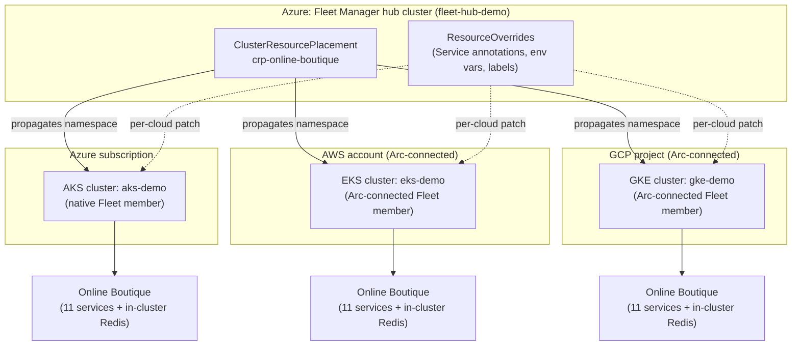

# Fleet Manager + Arc Multicloud Demo

A production-quality, cost-conscious demo that runs **Google's [Online
Boutique](https://github.com/GoogleCloudPlatform/microservices-demo)**
microservices app as **three fully independent deployments** — one each on
Azure Kubernetes Service (AKS), Amazon EKS, and Google GKE — unified under a
single **Azure Kubernetes Fleet Manager** control plane. AWS and GCP clusters
are onboarded via **Azure Arc**. Cloud-specific differences (load-balancer
annotations, environment badges, etc.) are applied entirely through Fleet
`ClusterResourcePlacement` + `ResourceOverride` objects — **the application
manifests themselves are never forked or cloud-specific.**



## Why this exists

A single source of truth for the application (`kubernetes/base/`) is
deployed identically to three clouds, with Fleet Manager acting as the one
control plane an operator interacts with — instead of three separate
`kubectl` contexts and three copy-pasted-and-drifted YAML trees. It's the
smallest possible demonstration of Fleet Manager and Arc's core value:
placement + override at scale, across cloud boundaries.

## Repository structure

```
terraform/
  azure/                  AKS + Fleet Manager (hub) + Fleet membership
  aws/                    VPC + EKS + node group + IAM (incl. LBC IRSA)
  gcp/                    VPC + GKE (zonal) + node pool + least-priv SA
  bootstrap/{azure,aws,gcp}/   Optional remote state backends (off by default)
  environments/demo/      Reads all 3 roots' local state -> one consolidated summary
kubernetes/
  base/                   Cloud-neutral Online Boutique v0.10.6 manifests
  fleet/                  ClusterResourcePlacement + member-label reference
  overrides/              ResourceOverride objects (per-cloud customization)
  validation/             Smoke-test Job used by scripts/08-validate-demo.ps1
scripts/                  00-99 PowerShell orchestration pipeline (see below)
docs/                     Architecture, auth, runsheet, ops, troubleshooting
.github/workflows/        CI: terraform fmt/validate, PowerShell parse, secret scan
```

## Prerequisites

| Tool | Required for | Install |
|---|---|---|
| `git` | everything | https://git-scm.com/downloads |
| `terraform` >= 1.9 | everything | `winget install HashiCorp.Terraform` |
| `kubectl` | everything | `winget install Kubernetes.kubectl` |
| `az` CLI | Azure, Fleet Manager, Arc (all 3 clouds) | `winget install Microsoft.AzureCLI` |
| `helm` | AWS Load Balancer Controller install | `winget install Helm.Helm` |
| `aws` CLI | AWS/EKS | `winget install Amazon.AWSCLI` |
| `gcloud` CLI | GCP/GKE | `winget install Google.CloudSDK` |
| PowerShell 5.1+ (7+ recommended) | running `scripts/*.ps1` | `winget install Microsoft.PowerShell` |
| `make` (optional) | convenience wrapper only | scripts run fine via `pwsh`/`powershell` directly |

Active, authenticated CLI sessions are required for every cloud you enable:
`az login`, `aws configure sso` (or `aws configure`), and
`gcloud auth login` + `gcloud auth application-default login`. **Console
username/password credentials cannot be converted into CLI credentials
programmatically** — see [docs/AUTHENTICATION-AND-PERMISSIONS.md](docs/AUTHENTICATION-AND-PERMISSIONS.md).

> If you only have Windows PowerShell (5.1) and see "running scripts is
> disabled on this system", either run via `pwsh` (PowerShell 7+, which
> defaults to a more permissive policy) or see
> [docs/TROUBLESHOOTING.md](docs/TROUBLESHOOTING.md#execution-policy).

## Quickstart

```powershell
Copy-Item .env.example .env    # then fill in OWNER, GCP_PROJECT_ID, etc.

make check-tools       # scripts/00-check-tools.ps1
make bootstrap-auth    # scripts/00-bootstrap-auth.ps1  (interactive logins)
make test-access       # scripts/01-test-cloud-access.ps1 (read-only)
make select-regions    # scripts/02-select-regions.ps1  (writes artifacts/region-selection.json)
make plan              # scripts/03-init-plan.ps1       (terraform init/validate/plan)
make apply             # scripts/04-apply.ps1           (BILLABLE - creates real infra)
make connect-arc       # scripts/05-connect-arc.ps1      (Arc-connect EKS + GKE)
make join-fleet        # scripts/06-join-fleet.ps1       (join all 3 to Fleet with labels)
make deploy-workload    # scripts/07-deploy-workload.ps1 (apply app + overrides + CRP to the hub)
make validate          # scripts/08-validate-demo.ps1    (smoke test + external endpoint checks)

make destroy           # scripts/99-destroy-all.ps1      (tears everything down, in reverse)
```

> **Read [docs/DEMO-RUNSHEET.md](docs/DEMO-RUNSHEET.md) before your first
> run.** It covers what to put in `.env`, timing per step, and one manual
> Azure RBAC assignment required between `join-fleet` and `deploy-workload`.

Every step only touches the clouds enabled in `.env`
(`ENABLE_AZURE`/`ENABLE_AWS`/`ENABLE_GCP`), so you can run Azure-only while
finishing AWS/GCP interactive auth separately. Azure must always be enabled —
it hosts the Fleet Manager hub the other clouds join. No `make` target other
than `apply`/`destroy` creates or destroys billable infrastructure, and both
of those require typed confirmation unless you pass `-AutoApprove`.

`make` is optional — every target is a one-line wrapper around the matching
script, so `pwsh scripts\04-apply.ps1` works identically.

## Cost

This demo creates **real, billable infrastructure** in every cloud you
enable: a Fleet Manager hub cluster and an AKS cluster on Azure, an EKS
cluster and node group on AWS, and a GKE cluster and node pool on GCP, plus
one public load balancer per cloud. Arc onboarding itself is free — you pay
for the underlying clusters.

Deliberate cost-conscious choices are documented in
[docs/ARCHITECTURE.md](docs/ARCHITECTURE.md#cost) (Free AKS SKU tier, no NAT
gateway, no autoscaling by default, `pd-standard` disks, small fixed node
counts). No figures are quoted here because cloud pricing changes frequently
— estimate your own with the
[Azure](https://azure.microsoft.com/pricing/calculator/),
[AWS](https://calculator.aws/), and
[GCP](https://cloud.google.com/products/calculator) pricing calculators
before you apply.

**Run `make destroy` when you're not actively demoing.** Nothing here is
designed to run unattended — see the runsheet's
[pause/resume section](docs/DEMO-RUNSHEET.md#pausing-and-resuming-clusters-without-deleting-them)
if you need to idle between sessions without a full teardown.

## Documentation

- [docs/DEMO-RUNSHEET.md](docs/DEMO-RUNSHEET.md) — **start here**: step-by-step execution, live demo talk track, pause/resume guidance
- [docs/AUTHENTICATION-AND-PERMISSIONS.md](docs/AUTHENTICATION-AND-PERMISSIONS.md) — exact login flows + required IAM roles per cloud
- [docs/ARCHITECTURE.md](docs/ARCHITECTURE.md) — full design rationale, networking, Fleet/override schema
- [docs/OPERATIONS.md](docs/OPERATIONS.md) — day-2 operations, scaling, updates, teardown
- [docs/TROUBLESHOOTING.md](docs/TROUBLESHOOTING.md) — real issues encountered building/running this repo, with fixes

## Upstream attribution

The application deployed here is
[Online Boutique](https://github.com/GoogleCloudPlatform/microservices-demo)
by Google, licensed under Apache License 2.0, pinned to release
[`v0.10.6`](https://github.com/GoogleCloudPlatform/microservices-demo/releases/tag/v0.10.6).
This repo does not modify the application itself — only how and where it is
deployed.

## Contributing

Issues and pull requests are welcome — see
[CONTRIBUTING.md](CONTRIBUTING.md). To report a security concern, see
[SECURITY.md](SECURITY.md).

## License

MIT — see [LICENSE](LICENSE). This is demonstration code provided as-is;
several deliberate cost-saving choices (public EKS node subnets, no NAT
gateway, zonal GKE, Free-tier AKS SKU) are **not** production-appropriate.
See [docs/ARCHITECTURE.md](docs/ARCHITECTURE.md) for which ones and why.
