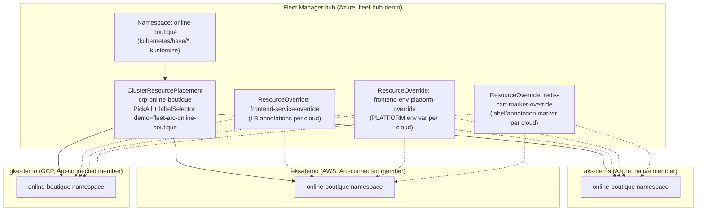

# Architecture

## Goals and non-goals

**Goals:**
- Three fully independent Online Boutique deployments (AKS, EKS, GKE), each capable of running standalone.
- One unified control plane (Azure Kubernetes Fleet Manager) for placement and cloud-specific customization.
- Never fork the application manifests — all cloud differences expressed as Fleet `ResourceOverride` patches on top of one shared `kubernetes/base/`.
- Cost-conscious defaults suitable for a demo that gets torn down, not a production system left running.
- Automatic, reasoned region/zone selection per cloud (written to `artifacts/region-selection.json` by `scripts/02-select-regions.ps1`).

**Non-goals (explicitly out of scope for this demo):**
- High availability / multi-region within a single cloud.
- Custom DNS or TLS (each cloud's default LoadBalancer public IP/hostname is used as-is).
- A managed/external Redis (Memorystore, ElastiCache, Azure Cache) — Online Boutique's `cartservice` uses the upstream in-cluster `redis:7.4-alpine` Deployment in all three clouds, keeping the three deployments symmetric and avoiding three more cloud-specific Terraform modules for a demo cache.
- CI/CD to production — `.github/workflows/ci.yml` only lints and validates the repository; nothing in this repo deploys automatically.

## Component diagram



## Fleet Manager + membership model

- **Fleet Manager** (`azapi_resource`, `Microsoft.ContainerService/fleets@2024-04-01` via `terraform/azure/main.tf`) is created **with a hub cluster** (`hubProfile` populated) — the hub is what runs `ClusterResourcePlacement`/`ResourceOverride` objects; a hubless Fleet cannot.
- **AKS (`aks-demo`)** joins Fleet as a **native member** — Terraform's `azurerm_kubernetes_cluster` and the Fleet member are both in-subscription ARM resources, so `az fleet member create --member-cluster-id <AKS ARM ID>` works directly.
- **EKS (`eks-demo`)** and **GKE (`gke-demo`)** are not Azure resources, so they first go through **Azure Arc** (`az connectedk8s connect`), which projects them into the same Azure resource group as `Microsoft.Kubernetes/connectedClusters/*` ARM resources. Only after that can `az fleet member create --member-cluster-id <connectedCluster ARM ID>` join them — Fleet membership always requires an ARM resource ID, native or Arc-projected.
- All three members receive identical labels at join time via `az fleet member create --member-labels` (see `kubernetes/fleet/member-labels-reference.yaml` for the exact schema: `cloud`, `provider`, `demo`, `location`, `environment`). Every placement/override selector in this repo targets these hand-applied labels — never Azure-only auto-labels like `fleet.azure.com/location` — so all three clouds are selected symmetrically.

## Placement and override model

- **One `ClusterResourcePlacement`** (`crp-online-boutique`) selects the `online-boutique` Namespace, which cascades to every resource created inside it (kustomize handles the resource list — see `kubernetes/base/kustomization.yaml`). Policy is `PickAll` scoped by `clusterSelectorTerms: demo=fleet-arc-online-boutique`, not a bare `PickAll`, so the intent ("every member of *this* demo") is explicit and safe if the hub ever gains unrelated members.
- **Three `ResourceOverride` objects**, one per customization concern, each with **one overrideRule per cloud** (`clusterSelector: cloud=azure|aws|gcp`) rather than one giant multi-resource override — this keeps each override auditable and independently reviewable:
  1. `frontend-service-override` — LoadBalancer Service annotations: `service.beta.kubernetes.io/azure-load-balancer-health-probe-request-path` (Azure), `service.beta.kubernetes.io/aws-load-balancer-type: nlb` (AWS), `cloud.google.com/l4-rbs: enabled` (GCP).
  2. `frontend-env-platform-override` — injects a `PLATFORM=azure|aws|gcp` env var into the frontend Deployment (Online Boutique's frontend already reads a `PLATFORM` variable to render a platform badge — no application code changes needed).
  3. `redis-cart-marker-override` — a small label/annotation marker on the Redis Deployment per cloud, purely to make `kubectl get deploy -l cloud=X` demonstrations obvious.
- All three overrides declare `spec.placement.name: crp-online-boutique`, so an override change reconciles immediately rather than waiting for the CRP's next scheduled rollout.
- API surface used throughout: `placement.kubernetes-fleet.io/v1` (**stable/GA**, not `v1beta1`, which is reserved for preview namespace-scoped placement features this demo doesn't use). Verified directly against Microsoft Learn during construction of this repo (see citations inside each YAML file's header comment).

## Per-cloud cluster design

| | Azure (AKS) | AWS (EKS) | GCP (GKE) |
|---|---|---|---|
| Cluster type | Regional, Azure CNI Overlay | Regional (API auth mode) | **Zonal** (`us-central1-a` by default) |
| Control plane SKU/tier | Free SKU (no Uptime SLA) | Standard | Zonal management tier |
| Nodes | 2x Standard_D2s_v3 (fixed, no autoscale by default) | 2x t3.large ON_DEMAND (managed node group) | 2-4x e2-standard-2 (autoscaling node pool) |
| Networking | Azure CNI Overlay (pod CIDR does not consume VNet IPs) | Custom VPC, 2 **public** subnets, **no NAT gateway** (nodes get public IPs directly — see cost note below) | Custom VPC-native network with secondary ranges (pods/services), internal LB firewall rules |
| Ingress path | `type: LoadBalancer` Service -> Azure Standard LB | `type: LoadBalancer` Service -> AWS Load Balancer Controller (IRSA) -> NLB | `type: LoadBalancer` Service -> GCP L4 regional backend service |
| Identity for node workloads | Kubelet managed identity | IRSA (IAM Roles for Service Accounts) via OIDC provider | Dedicated least-privilege node service account (not Compute Engine default SA) |

**Why no NAT gateway on AWS:** a NAT gateway bills hourly plus data
processing charges just to let private-subnet nodes reach the internet
(pulling container images, talking to the EKS API, etc.). Since this is a
demo with public endpoints already accepted as in-scope, nodes sit in
**public** subnets with public IPs and tightly-scoped security groups
instead — functionally sufficient here, but explicitly **not** the pattern
to copy for a production EKS cluster (private subnets + NAT, or VPC
endpoints, are the production-appropriate choice).

**Why zonal GKE, not regional:** a regional GKE cluster replicates the
control plane across 3 zones for HA, at a correspondingly higher management
fee and additional cross-zone node spread. For a demo that prioritizes cost
over control-plane HA, zonal is the documented, appropriate choice —
`deletion_protection = false` is also set so `terraform destroy` /
`scripts/99-destroy-all.ps1` can tear it down without a manual override step.

## Terraform layout rationale

```
terraform/azure/            # standalone root: RG, AKS, Fleet Manager+hub, AKS's Fleet membership
terraform/aws/               # standalone root: VPC, IAM, EKS, node group, LBC via helm_release
terraform/gcp/                # standalone root: APIs, VPC-native network, GKE, node pool, node SA
terraform/bootstrap/{azure,aws,gcp}/   # optional remote state backends, OFF by default (create_state_backend=false)
terraform/environments/demo/           # reads all 3 roots' *local* state via terraform_remote_state, produces one consolidated `summary` output
```

Each cloud root is **fully independent** — no root has a `depends_on` or
data dependency on another cloud's Terraform state. This is deliberate: it
lets you `terraform apply` Azure-only while AWS/GCP credentials are still
being sorted out, and it means a failure
or teardown in one cloud can never corrupt another cloud's state.

`terraform/bootstrap/` is split into **three independent per-cloud
subfolders** rather than one combined root. During construction of this
repo we found that a single root declaring all three providers
(`azurerm`+`aws`+`google`) together forces Terraform to attempt credential
resolution for **all three** clouds during `plan`, even when every resource
in two of them is `count = 0` — reproduced directly (AWS IMDS timeout + GCP
ADC errors appeared even with every creation flag set `false`). Splitting
into one-provider-per-folder resolves this: each folder now only ever
authenticates the one cloud it declares, matching how `terraform/azure`,
`terraform/aws`, and `terraform/gcp` already behave.

`terraform/environments/demo` reads the other three roots' **local** state
files via `data "terraform_remote_state" { backend = "local" }`. A
plain `terraform_remote_state` data source **hard-errors** if the state
file it points at doesn't exist yet (a data-source-read failure, which
`try()` around the output value cannot catch). The fix applied here: gate
each data source itself with `count = fileexists(var.X_state_path) ? 1 : 0`,
then index `[0]` — now a missing state file produces an
index-out-of-range error on the *reference*, which `try()` in `outputs.tf`
**can** catch, degrading gracefully to a placeholder string. This lets
`environments/demo` produce a sensible "not applied yet" summary with zero
cloud credentials and zero existing state — verified via a real
`terraform plan`, not just `validate`.

## Cost

Every cloud here bills for what it creates. Deliberate cost-conscious
choices are made throughout — no figures are quoted anywhere in this repo,
because cloud pricing changes frequently; use each provider's own pricing
calculator:

- AKS: **Free** SKU tier — avoids the Uptime SLA charge the Standard/Premium tiers add, acceptable since this is a demo, not a production system needing an availability SLA.
- AWS: **no NAT gateway** (see above); ON_DEMAND by default, with SPOT available via `node_capacity_type` for further savings at the cost of possible mid-demo interruption.
- GCP: **`pd-standard`** disks (not SSD), zonal (not regional) cluster, node pool autoscaling floor of 2 (not a fixed larger count).
- All three: fixed/small node counts (2, matching Online Boutique's ~12-pod footprint), no Log Analytics / Container Insights / Cloud Logging extras enabled by default (`enable_diagnostics = false` where applicable).
- Nothing in this repo is designed to run unattended for a long period — `make destroy` / `scripts/99-destroy-all.ps1` is a first-class, documented step, not an afterthought.
